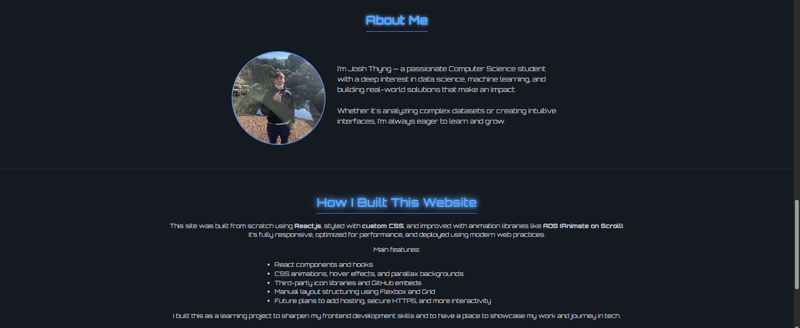

# Josh Thyng Portfolio Website

Welcome to my personal portfolio website! This site was built from scratch to showcase my skills, projects, and experience in computer science, data analysis, and web development.

---

## Built With

- **React.js** — Frontend library used for building UI components  
- **Custom CSS** — For responsive styling, glowing hover effects, dark mode, and layout control  
- **AOS (Animate on Scroll)** — Smooth scroll-based animations  
- **Flexbox/Grid** — Manual layout for clean structure  
- **JSX/HTML/JS** — Pure frontend build

---

## Preview

Here are some screenshots of the live site:

### Hero Section  

### Technologies & Concepts  

### Tech Stack  

### Projects  

### Resume Viewer  

### About Me Section  

### How I Built This Website  
